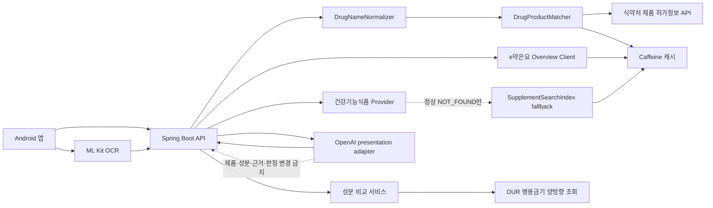
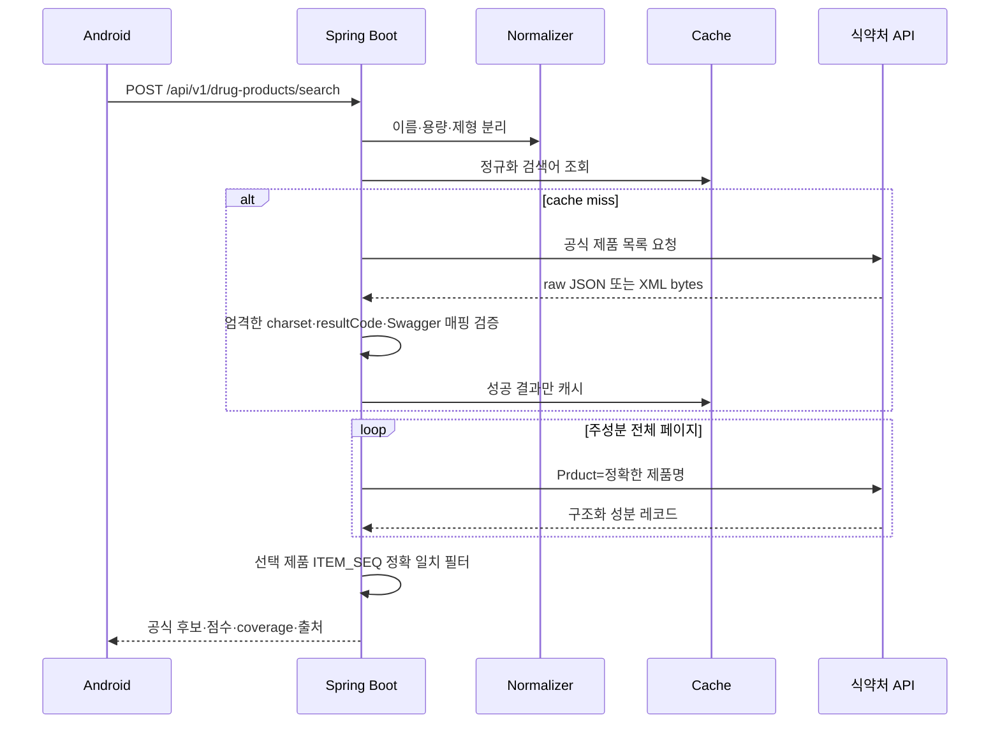
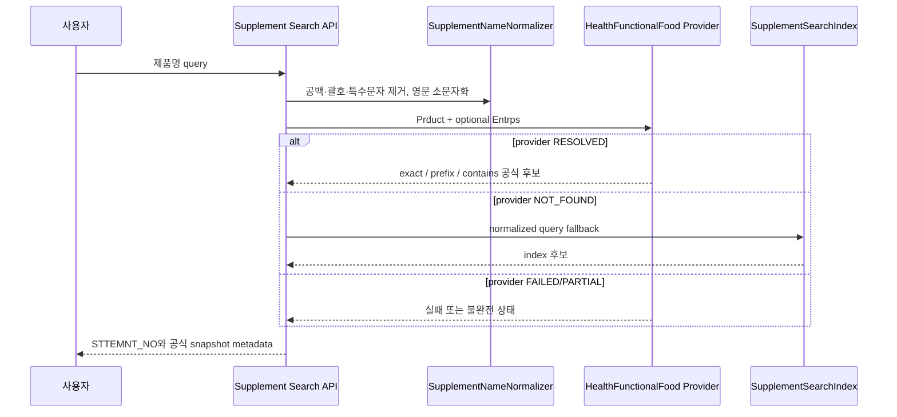
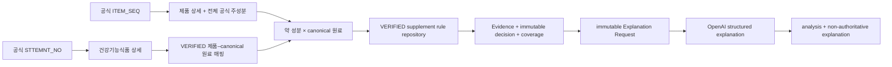
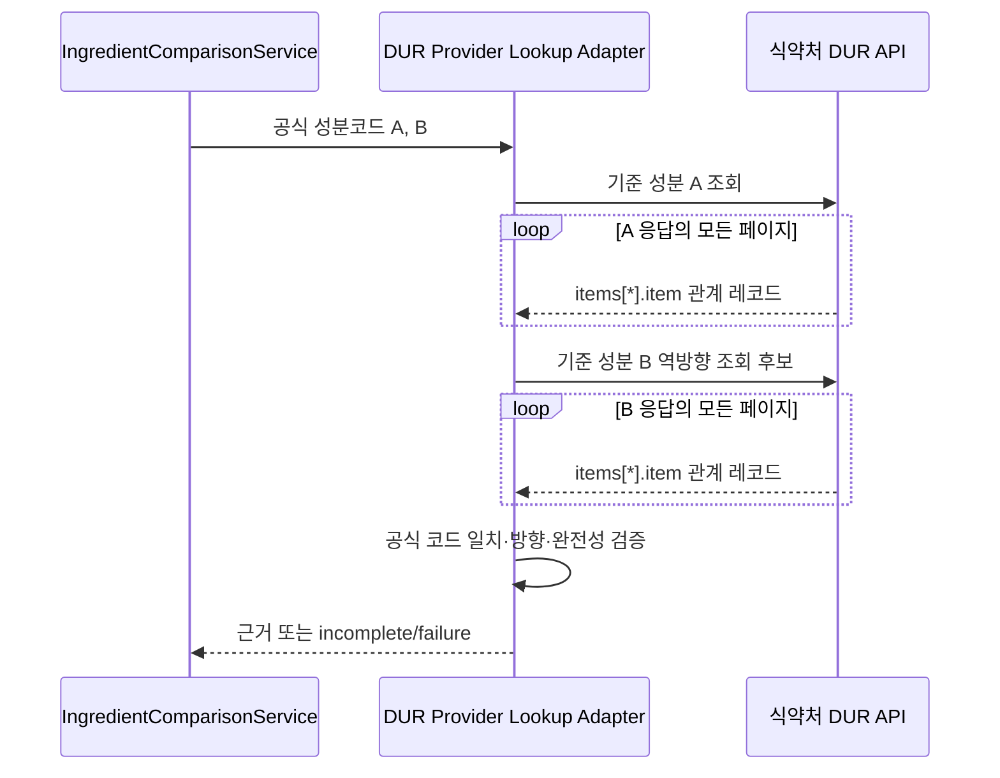

# Architecture

## 신뢰 경계

LLM은 `SupplementInteractionAnalysisService` 뒤의 presentation layer입니다. `SupplementInteractionPresentationService`가 deterministic analysis를 먼저 완료하고 `toExplanationRequest()` 결과만 OpenAI adapter에 전달합니다. LLM은 제품·성분·DUR·supplement rule, severity, coverage 또는 실패 단계를 생성하거나 변경할 수 없습니다.

## 제품 검색 흐름

## 캐시

- 검색 성공: 6시간
- 검색 성공 빈 결과: 5분
- 성분 성공: 24시간
- e약은요 정상 결과: 24시간, 정상 미제공: 기존 짧은 negative TTL
- 인증·quota·timeout·파싱 오류: 캐시하지 않음
- 운영 버전에서는 `DrugProductCache` 경계를 Redis 구현으로 교체 가능

## 공공데이터 클라이언트 경계

- `PublicDataCredentialsProperties`: 네 data.go.kr API가 공유하는 단일 서비스키만 보유
- API properties: 각 API의 endpoint, 매핑, `PublicDataClientPolicy`를 보유
- `PublicDataCallExecutorFactory`: 정책마다 독립 executor를 생성
- API별 executor: rate-limit window, bulkhead semaphore, circuit failure count/open time을 서로 공유하지 않음

현재 Spring context에는 제품 허가정보용 `drugProductCallExecutor`, DUR용 `durCallExecutor`, e약은요용 `drugOverviewCallExecutor`, 건강기능식품용 `healthFunctionalFoodCallExecutor`가 각각 존재합니다. 각 인스턴스의 rate-limit window, bulkhead, circuit failure 상태는 공유하지 않습니다. 공통 계정 quota용 전역 rate limiter는 후속 검토 사항입니다.

DUR 병용금기 operation은 실제 curl과 현재 Spring 전송 경로에서 HTTP 200으로 검증했습니다. opt-in 외부 통합 테스트에서 `resultCode=00`, `totalCount=19`, 고유 관계 성분코드 19개와 strict UTF-8을 확인했습니다. 이미 인코딩된 키를 form-style로 다시 인코딩하면 같은 요청이 HTTP 403이 되는 회귀 조건도 분리해 확인했습니다.

## e약은요 어댑터

- `GET /getDrbEasyDrugList`, 인증 변수는 대문자 `ServiceKey`
- 먼저 `itemSeq`로 정확 조회하고 정상 0건일 때만 `itemName`과 선택적 `entpName`으로 fallback
- `/body/items`는 record의 직접 배열이며 모든 페이지에서 입력 품목기준코드 재검증
- `efcyQesitm`, `useMethodQesitm`, 경고·주의·상호작용·부작용·보관 필드는 공식 원문과 의미를 바꾸지 않은 표시용 텍스트를 함께 보존
- 정상 `resultCode=00`, `totalCount=0`, items 생략 또는 빈 배열만 `NOT_FOUND`; provider 실패는 `FAILED`, 중간 실패는 `PARTIAL`
- e약은요 미제공은 제품이나 효능 부재가 아니고 기존 medication/ingredient를 변경하지 않음

## 건강기능식품 제품정보 경계

`HtfsInfoService03` provider는 목록 `/getHtfsList01`과 상세 `/getHtfsItem01`을 독립 RestClient/executor로 호출합니다. 공식 포털 Swagger에는 pagination·인증·형식만 노출되어 있지만 실제 gateway에서 목록 `Prduct`·`Entrps`·`Sttemnt_no`, 상세 `STTEMNT_NO` 필터를 검증했습니다. `Product`는 실제로 필터되지 않아 사용하지 않습니다.

응답은 `/body/items[*]/item`을 매핑하고 모든 페이지가 성공해야 `complete=true`입니다. 정상 `resultCode=00`, `totalCount=0`, items 생략만 `NOT_FOUND`이며 중간 실패는 `PARTIAL`, 인증·quota·timeout·provider 오류는 `FAILED`입니다. 상세 snapshot은 공식 확인된 필드와 raw provider record만 보존합니다.

향후 `SupplementEvidenceBundle`은 제품을 조회하더라도 `rawMaterialStatus=NOT_IMPLEMENTED`, 원재료는 `NotRequested`, `ruleEvidence=NOT_EVALUATED`, `coverage.complete=false`를 유지합니다. DUR은 약–약 병용금기 전용이고 건강기능식품을 DUR 성분코드와 직접 비교하지 않습니다.

### C003 원재료 데이터 경계

건강기능식품 품목제조신고(원재료)는 `HtfsInfoService03`의 하위 operation이 아니라 별도 식품안전나라 `C003` 서비스입니다. 인증도 공통 `DATA_GO_KR_SERVICE_KEY` query가 아니라 식품안전나라에서 발급한 `keyId` 경로 segment를 사용하고, pagination은 `pageNo`/`numOfRows`가 아닌 `startIdx`/`endIdx`입니다. 그러므로 기존 건강기능식품 제품용 credentials, URI factory, executor에 억지로 결합하지 않습니다.

공식 출력은 제품별 `PRDLST_REPORT_NO`와 단일 `RAWMTRL_NM` 문자열만 제공하며 구조화 원재료 record, 원재료 코드, 구분, 함량, 단위, 배합비, 순번은 제공하지 않습니다. 상세 하위 원재료와 배합비도 제공 범위에서 제외됩니다. 안전한 record 경계를 확인하기 전에는 문자열을 분해하거나 이름으로 의미를 추론하지 않으며, 원재료 adapter와 evidence 연결은 구현하지 않습니다. 규칙 DB가 없으므로 이후 원재료 근거가 확보되더라도 전체 supplement coverage는 자동으로 완전해지지 않습니다.

## 건강기능식품 검색 인덱스

현재 loader는 빈 메모리 snapshot을 공급하며 provider의 정상 `NOT_FOUND`에서만 사용됩니다. 동일 `STTEMNT_NO`는 최초 한 건만 유지하고 query 결과는 Caffeine에 캐시합니다. provider 오류는 fallback이나 정상 캐시 대상이 아닙니다.

향후 loader를 DB, CSV, 공공데이터 전체 동기화 또는 Elasticsearch 구현으로 교체해도 검색 서비스 경계는 유지합니다. 상세 provider는 `findByStatementNo` 서비스 경계로 구현했지만 public 상세 endpoint는 추가하지 않았습니다.

## 약–건강기능식품 판정 파이프라인

`SupplementInteractionAnalysisService`는 공식 약 제품과 전체 성분, 공식 건강기능식품 snapshot, 현재 유효한 VERIFIED 매핑을 확인한 뒤 전체 Cartesian pair를 평가합니다. `AVOID_COMBINATION`이 `CAUTION`보다 우선하며, 위험 규칙이 확인된 경우 다른 pair 실패가 있어도 확인된 위험은 유지하되 coverage와 processing status는 불완전하게 표시합니다.

모든 입력과 pair가 완전하고 rule repository가 정상인데 일치 규칙만 없을 때 `NO_VERIFIED_RULE_FOUND`입니다. 제품 미확인, 공식 성분코드 누락, 검수 매핑 부재, repository 실패 또는 pair 실패는 `UNKNOWN`입니다. DUR adapter는 계속 약–약 전용이며 supplement product/canonical ID를 전달하지 않습니다.

LLM 호출 실패는 위 severity에 영향을 주지 않습니다. `GENERATED`, `FALLBACK`, `UNAVAILABLE` explanation 상태를 별도로 반환하며 UNKNOWN/NO_VERIFIED_RULE_FOUND에서 확정적 안전 표현이 감지되면 전체 LLM 설명을 버리고 deterministic fallback을 사용합니다. OpenAI client는 공공데이터 executor와 분리된 timeout, retry, bulkhead와 circuit 상태를 가집니다.

현재 repository 구현은 교체 가능한 네 interface와 JSON startup loader입니다. production `supplement-interaction-rules.json`은 빈 배열만 포함하며 실제 의료 규칙 seed는 없습니다. 검수 데이터는 source → canonical ingredient → product mapping/rule 참조 무결성, VERIFIED source, 유효기간, 중복 활성 규칙, manifest count와 checksum 검증을 통과해야 production에서 사용됩니다. 향후 동일 interface 뒤에 관리형 DB를 연결할 수 있습니다.

## Supplement rule catalog governance

작성 catalog는 `SupplementRuleCatalogValidator`가 JSON shape와 semantic integrity를 함께 검사합니다. `validateSupplementRuleCatalog`는 읽기 전용 검증과 JSON report만 만들고, `buildVerifiedSupplementRuleCatalog`는 오류가 없고 reviewer/catalogVersion이 주어진 경우에만 별도 VERIFIED artifact를 원자적으로 생성합니다. 원본 파일은 변경하지 않습니다.

startup loader는 기본적으로 `manifest.status=VERIFIED`, schema `1.0`, record count와 content SHA-256 일치를 요구합니다. 파일 부재나 검증 실패는 application context를 중단하지 않고 모든 catalog repository를 unavailable로 격리합니다. 분석기는 이를 `RULE_CATALOG_UNAVAILABLE`, `UNKNOWN`, incomplete coverage로 기록합니다. 로그에는 resource 경로와 안전한 오류 코드만 남기며 source 원문은 남기지 않습니다.

`SupplementRuleCatalogAuditMetadata`는 catalog version, schema version, checksum, loadedAt과 record count를 분석 결과 및 evidence bundle에 보존합니다. 개별 source/rule의 선택적 `sourceVersion`/`ruleVersion`도 evidence와 LLM presentation DTO까지 보존됩니다. 인증 계층이 없으므로 catalog status public/internal HTTP endpoint는 추가하지 않았고, 내부 상태 서비스만 제공합니다.

실패 단계는 `SupplementInteractionFailureCode` enum으로 service, Evidence Bundle, REST, LLM 직전 DTO가 동일하게 사용합니다. coverage 백분율은 제품·성분·매핑·catalog의 6개 semantic checkpoint와 전체 pair를 분모로 하고, 통과 checkpoint와 평가 완료 pair를 분자로 계산합니다. 따라서 pair가 0개인 `0/0`이나 제품/매핑 식별 실패가 100%가 되지 않습니다. e약은요 `NOT_FOUND`는 optional overview coverage로 보존하고 공식 약 제품·성분이 완전하면 rule 판정은 계속합니다.

## 의약품 허가정보 어댑터

- 목록 `/getDrugPrdtPrmsnInq07`: `item_name` 검색, `ITEM_SEQ`·`ITEM_NAME`·`ENTP_NAME` 매핑
- 상세 `/getDrugPrdtPrmsnDtlInq06`: `item_seq` 정확 조회를 지원하지만 현재 검색 흐름에서는 호출하지 않음
- 주성분 `/getDrugPrdtMcpnDtlInq07`: `Prduct`로 조회하고 모든 페이지에서 `ITEM_SEQ`를 검증
- 구조화 성분: `MTRAL_CODE`, `MTRAL_NM`, `QNT`, `INGD_UNIT_CD`
- 페이지 하나라도 실패하거나 전체 items 수가 `totalCount`와 다르면 성공 결과를 만들지 않음
- 응답 제품이 선택 제품과 일치하지 않으면 `PUBLIC_API_RESPONSE_MISMATCH`로 격리
- 원본 byte를 JSON charset 미지정 시 UTF-8로 엄격 디코딩하며 손실 문자를 허용하지 않음

## DUR 병용금기 어댑터

확인된 병용금기 경계는 Base URL과 `GET /getUsjntTabooInfoList02`이며, 현재 성공 샘플은 기준 성분 A를 `ingrCode`/`ingrKorName`으로 요청해 `INGR_CODE` 기준의 `MIXTURE_INGR_CODE` 관계 레코드 목록을 반환하는 형태입니다. A와 B를 동시에 요청하는 변수와 데이터 방향 대칭성은 확인되지 않았습니다.

구현은 raw byte를 공통 strict decoder로 처리하고 U+FFFD를 거부한 뒤 `resultCode`, 페이지 메타데이터, 중첩 `items[*].item`, `TYPE_NAME`, 기준 코드와 관계 코드를 검증합니다. `totalCount=0`이고 정상 resultCode이며 items가 생략되거나 빈 배열인 경우만 완전한 `NO_MATCH` 후보로 반환합니다. provider 오류 또는 중간 페이지 실패는 `FAILED`/`PARTIAL`이고 `complete=false`입니다.

- 기준 성분 코드: `INGR_CODE`; 관계 성분 공식 코드: `MIXTURE_INGR_CODE`
- 관계는 결합 문자열이 아니라 `/body/items/*/item`의 개별 레코드로 처리
- `totalCount`/`numOfRows` 기반 모든 페이지 수집이 완료돼야 한 방향 조회가 complete
- A→B와 B→A를 각각 전체 조회하고 양방향 complete일 때만 관계 없음 후보로 유지
- 어느 방향이든 공식 관계가 확인되면 해당 방향의 원본 근거를 보존
- 관계 없음은 양방향·모든 페이지 성공과 실제 0건 명세가 확인된 뒤에만 판정 후보
- 중간 페이지 실패, 응답 기준코드 불일치, 비정상 resultCode, 손실 인코딩은 실패 또는 incomplete
- 공식 record ID가 확인되지 않아 evidence의 `sourceRecordId`는 nullable 후보이며 내부 식별자를 공식 번호로 표시하지 않음
- 공식 record ID는 제공 필드에서 확인되지 않아 `providerRecordId=null`을 유지
- 내부 중복 제거 키 `(INGR_CODE, MIXTURE_INGR_CODE, NOTIFICATION_DATE, TYPE_NAME, PROHBT_CONTENT)`는 공식 DUR ID가 아님
- `DurLookupService`는 검증되지 않은 코드 단독 조회를 거부하고 코드와 한글명이 모두 있는 요청만 provider client에 전달
- ACTIVE 관계는 공식 원문 evidence로 변환하고 공식 record ID가 없으므로 `sourceRecordId=null`을 유지
- 한 방향에서 위험이 확인되고 다른 방향이 실패하면 위험 severity를 유지하되 pair와 coverage는 incomplete
- UNKNOWN provider status는 안전 실패이며 DELETED 관계는 현재 ACTIVE 근거로 사용하지 않음

`DrugInteractionAnalysisService`는 두 공식 제품의 전체 성분을 조회한 뒤 `IngredientComparisonService`의 Cartesian DUR 비교를 호출합니다. 공개 비동기 `POST/GET /interaction-checks`와 영속 상태 전이는 기존 Android 계약과 함께 별도 단계이며, 현재 supplement endpoint는 동기식입니다.

## 비동기 분석 방향

약–건강기능식품 `POST /api/v1/supplement-interaction-checks`는 동기식이며 억지로 비동기화하지 않습니다. 약–약 내부 `DrugInteractionAnalysisService`도 동기식 공식 제품→성분→DUR orchestration입니다. 기존 Android에 선언된 비동기 `POST/GET /interaction-checks`를 구현할 때는 `PENDING` 저장 → 제한된 executor → `COMPLETED/PARTIAL/FAILED` 저장 → GET polling 순서로 구성합니다. JVM 재시작 보존이 필요한 운영 버전의 DB/outbox/queue는 별도 승인 범위입니다.
