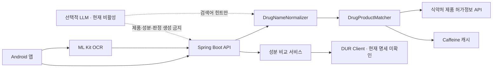
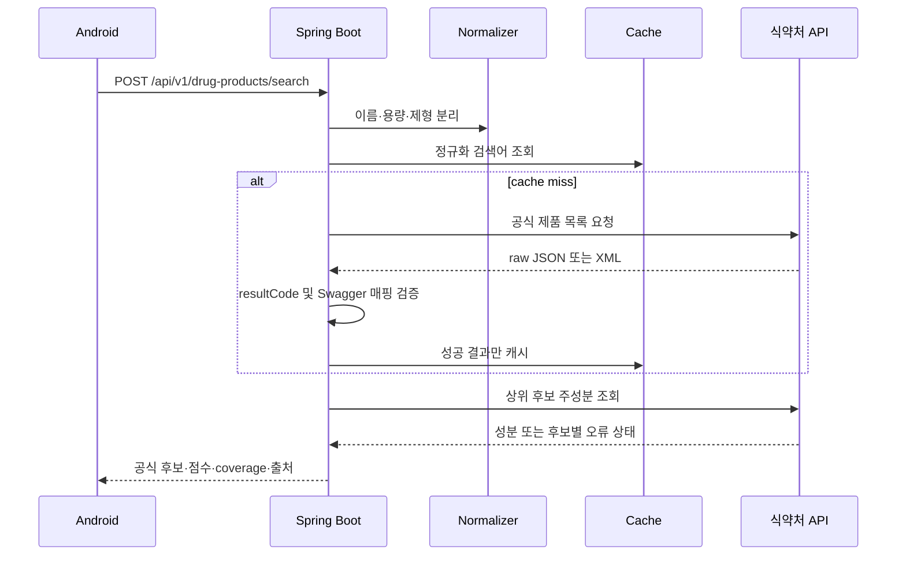

# Architecture

## 신뢰 경계

LLM 경계는 현재 구현하지 않았습니다. 추후 추가하더라도 출력 타입은 검색 문자열 힌트로 제한하고 `VerifiedDrugProduct`나 `Ingredient`를 생성할 수 없게 분리합니다.

## 제품 검색 흐름

## 캐시

- 검색 성공: 6시간
- 검색 성공 빈 결과: 5분
- 성분 성공: 24시간
- 인증·quota·timeout·파싱 오류: 캐시하지 않음
- 운영 버전에서는 `DrugProductCache` 경계를 Redis 구현으로 교체 가능

## 비동기 분석 방향

현재는 동일 성분 비교 도메인까지만 구현했습니다. `POST /interaction-checks`를 구현할 때는 `PENDING` 저장 → 제한된 executor → `COMPLETED/PARTIAL/FAILED` 저장 → GET polling 순서로 구성합니다. JVM 재시작에도 작업이 보존되어야 하는 운영 버전에서는 DB outbox와 메시지 큐를 사용합니다.
