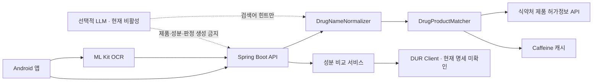
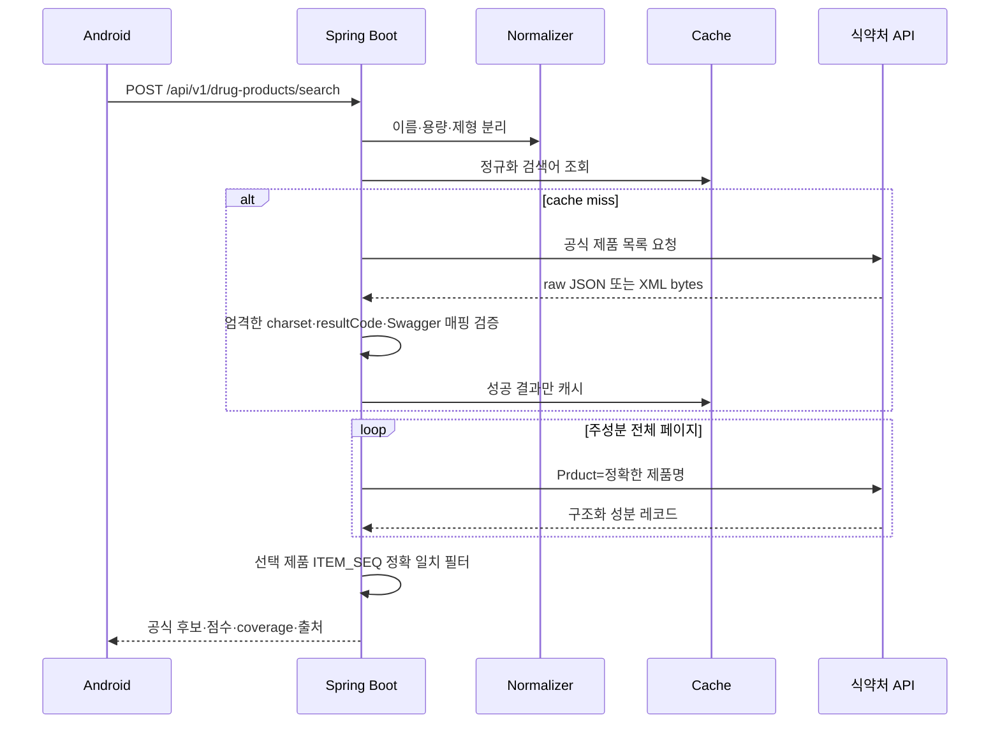

# Architecture

## 신뢰 경계

LLM 경계는 현재 구현하지 않았습니다. 추후 추가하더라도 출력 타입은 검색 문자열 힌트로 제한하고 `VerifiedDrugProduct`나 `Ingredient`를 생성할 수 없게 분리합니다.

## 제품 검색 흐름

## 캐시

- 검색 성공: 6시간
- 검색 성공 빈 결과: 5분
- 성분 성공: 24시간
- 인증·quota·timeout·파싱 오류: 캐시하지 않음
- 운영 버전에서는 `DrugProductCache` 경계를 Redis 구현으로 교체 가능

## 공공데이터 클라이언트 경계

- `PublicDataCredentialsProperties`: 네 data.go.kr API가 공유하는 단일 서비스키만 보유
- API properties: 각 API의 endpoint, 매핑, `PublicDataClientPolicy`를 보유
- `PublicDataCallExecutorFactory`: 정책마다 독립 executor를 생성
- API별 executor: rate-limit window, bulkhead semaphore, circuit failure count/open time을 서로 공유하지 않음

현재 Spring context에는 구현된 제품 허가정보용 `drugProductCallExecutor`만 있습니다. 이후 DUR 성분정보, 건강기능식품 제품정보, 건강기능식품 품목제조신고 원재료정보를 추가할 때 같은 factory로 각각 별도 executor를 생성합니다. retry는 실행기 호출 안에서만 관리되며 다른 API 상태에 영향을 주지 않습니다. 공통 계정 quota용 전역 rate limiter는 후속 검토 사항입니다.

DUR과 두 건강기능식품 API의 실제 operation은 아직 구현하지 않았습니다. 공식 Swagger가 없는 operation path, 요청변수, 응답 필드는 추측하여 추가하지 않습니다.

## 의약품 허가정보 어댑터

- 목록 `/getDrugPrdtPrmsnInq07`: `item_name` 검색, `ITEM_SEQ`·`ITEM_NAME`·`ENTP_NAME` 매핑
- 상세 `/getDrugPrdtPrmsnDtlInq06`: `item_seq` 정확 조회를 지원하지만 현재 검색 흐름에서는 호출하지 않음
- 주성분 `/getDrugPrdtMcpnDtlInq07`: `Prduct`로 조회하고 모든 페이지에서 `ITEM_SEQ`를 검증
- 구조화 성분: `MTRAL_CODE`, `MTRAL_NM`, `QNT`, `INGD_UNIT_CD`
- 페이지 하나라도 실패하거나 전체 items 수가 `totalCount`와 다르면 성공 결과를 만들지 않음
- 응답 제품이 선택 제품과 일치하지 않으면 `PUBLIC_API_RESPONSE_MISMATCH`로 격리
- 원본 byte를 JSON charset 미지정 시 UTF-8로 엄격 디코딩하며 손실 문자를 허용하지 않음

## 비동기 분석 방향

현재는 동일 성분 비교 도메인까지만 구현했습니다. `POST /interaction-checks`를 구현할 때는 `PENDING` 저장 → 제한된 executor → `COMPLETED/PARTIAL/FAILED` 저장 → GET polling 순서로 구성합니다. JVM 재시작에도 작업이 보존되어야 하는 운영 버전에서는 DB outbox와 메시지 큐를 사용합니다.
